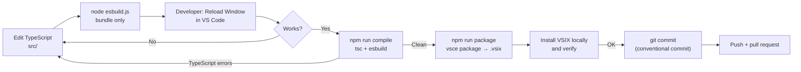
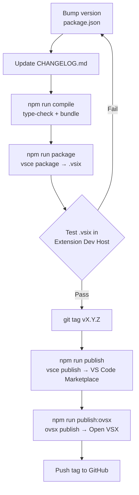

# Contributing to WxO ToolBox VS Code Extension

Contributions are welcome! This is the source repository for the **WxO ToolBox** VS Code extension (`WxO-ToolBox-vsc`) — an IBM Watsonx Orchestrate toolbox that lets you export, import, compare, replicate, and manage Watson Orchestrate agents, tools, flows, and connections directly from VS Code via the `orchestrate` CLI.

**Author:** Markus van Kempen (markus.van.kempen@gmail.com)  
**Date:** 06 Mar 2026  
**Repository:** [github.com/markusvankempen/WxO-ToolBox-vsc](https://github.com/markusvankempen/WxO-ToolBox-vsc)

## Before You Start

- Read the [README](./README.md) to understand features and configuration.
- Read the [USER_GUIDE.md](./USER_GUIDE.md) for a full walkthrough.
- Ensure **Node.js 18+** and **TypeScript 5.3+** are installed.
- The extension bundles and invokes the [WxO-ToolBox-cli](https://github.com/markusvankempen/WxO-ToolBox-cli) shell scripts.

## Tech Stack

| Technology | Purpose |
|-----------|---------|
| **TypeScript 5.3+** | Extension source (`src/`) |
| **esbuild** | Bundle `src/extension.ts` → `dist/extension.js` (fast, single-file) |
| **VS Code API 1.85+** | Extension host, webviews, tree views, SecretStorage |
| **Node.js 18+** | Runtime for build scripts |
| `@vscode/vsce` | Package and publish to VS Code Marketplace |
| `ovsx` | Publish to Open VSX Registry |

## Available Scripts

| Command | Description |
|---------|-------------|
| `npm run compile` | Type-check with `tsc` then bundle with `node esbuild.js` → `dist/extension.js` |
| `npm run watch` | Watch mode: re-run `tsc` on save (for type errors; does not re-bundle) |
| `npm run package` | Full package: `prepackage` (icons + scripts + compile) then `vsce package` → `.vsix` |
| `npm run publish` | Publish to VS Code Marketplace (`vsce publish`) |
| `npm run publish:ovsx` | Publish to Open VSX Registry (`ovsx publish`) |
| `npm run convert-icons` | Convert source icons to the required VS Code format |
| `npm run copy-scripts` | Copy CLI shell scripts from `../cli/` into `scripts/` |
| `node esbuild.js` | Bundle only (fast; skips type-check) — use after `tsc` passes |

> **Daily development loop:** Edit TypeScript in `src/`, run `node esbuild.js` to rebundle, then **Developer: Reload Window** in VS Code to pick up changes. Use `npm run compile` for a full type-check + bundle.

## Development Setup

1. **Clone the repo:**

    ```sh
    git clone https://github.com/markusvankempen/WxO-ToolBox-vsc.git
    cd WxO-ToolBox-vsc
    ```

2. **Install dependencies:**

    ```sh
    npm install
    ```

3. **Open in VS Code:**

    ```sh
    code .
    ```

4. **Run the extension in development:**

    Press **F5** (or **Run → Start Debugging** → "Run Extension") to launch a VS Code Extension Development Host with the extension loaded.  
    Or to bundle and test without the debugger:

    ```sh
    node esbuild.js
    # Then: Developer: Reload Window in VS Code
    ```

5. **Run a full type-check + bundle:**

    ```sh
    npm run compile
    ```

6. **Package a `.vsix` for local install:**

    ```sh
    npm run package
    # Produces WxO-ToolBox-vsc-<version>.vsix
    ```

    Install via **Extensions → "..." → Install from VSIX**.

### Development Loop



## Project Structure

```
src/
├── extension.ts                  # Entry point: activate(), registers all commands + tree
├── openapi-from-url.ts           # OpenAPI spec fetching utilities
├── openapi-templates.ts          # OpenAPI YAML/JSON templates for Create Tool
├── plugin-templates.ts           # Plugin YAML templates
├── panels/
│   ├── WxOObjectFormPanel.ts     # Create/Edit Agent, Flow, Connection (form + YAML editor)
│   ├── WxOCreateToolPanel.ts     # Create/Edit Tool (Python / OpenAPI)
│   ├── WxOCreatePluginPanel.ts   # Create Plugin form
│   ├── WxOPluginEditorPanel.ts   # Edit existing plugin
│   ├── WxOEnvFileEditorPanel.ts  # Edit .env_connection_* credential files
│   ├── WxOSystemEditorPanel.ts   # Add/edit WxO environments (Systems tab)
│   ├── WxOResourceJsonPanel.ts   # Read-only JSON viewer
│   ├── WxOScriptsPanel.ts        # Main panel (Export/Import/Compare/…)
│   └── WxOTraceDetailPanel.ts    # Observability trace detail
├── services/
│   ├── WxOCredentialsService.ts  # VS Code SecretStorage + .env fallback for API keys
│   ├── WxOEnvironmentService.ts  # orchestrate CLI wrappers (list, activate, export, …)
│   ├── WxOSystemsConfigService.ts# Systems config persistence
│   └── credentialsContext.ts     # Singleton accessor for credentials service
├── utils/
│   └── wxoEnv.ts                 # PATH/venv helpers
└── views/
    └── WxOImporterExporterView.ts# Tree view provider (Agents, Tools, Toolkits, Flows, …)

scripts/                          # Bundled WxO-ToolBox-cli shell scripts
resources/                        # Icons, screenshots
dist/                             # esbuild output (extension.js + source map)
```

## Key Patterns

### HTML webviews (panels)

All panels generate their HTML in a `_getHtml()` method using TypeScript template literals. **Important escape rules** that apply to all JS embedded within those templates:

- Regex literals and string escapes inside the HTML template must double all backslashes: `\\n`, `\\s`, `\\w`, `\\d`, etc. — a single `\n` inside a backtick template literal becomes a literal newline in the output, breaking the JavaScript.
- Use `escScriptJson()` (defined at the bottom of `WxOObjectFormPanel.ts`) to safely embed JSON data into `<script>` blocks — it escapes `</script>` sequences.
- Use `escForTextarea()` for content placed inside `<textarea>` elements.
- A debug HTML file is written to `.vscode/wxo-form-<type>-debug.html` every time a panel opens (controlled by `_debugWriteHtml()`). Open it in Chrome/Edge F12 to diagnose JavaScript errors in the webview.

### CLI invocation

All `orchestrate` CLI calls flow through `WxOEnvironmentService`. When the orchestrate CLI is installed inside a Python venv, the extension prepends `venv/bin` to `PATH` using the `WxO-ToolBox-vsc.orchestrateVenvPath` setting.

### Credential storage

API keys are stored in VS Code `SecretStorage` (key: `WxO-ToolBox-vsc.apiKey.<envName>`). The `.env` file fallback uses `WXO_API_KEY_<ENVNAME>` (uppercase). Note: `.env` variables named `WO_<ENV>_API_KEY` are **not** automatically picked up — use the Systems tab or SecretStorage.

## Conventional Commits

We use [Conventional Commits](https://www.conventionalcommits.org/) for commit messages:

```
<type>(<scope>): <subject>
```

**Types:** `feat`, `fix`, `chore`, `docs`, `style`, `refactor`, `perf`, `test`

**Scopes:** `agents`, `tools`, `flows`, `connections`, `plugins`, `panels`, `tree`, `env`, `credentials`, `observability`, `scripts`, `docs`, `deps`

**Examples:**

```
feat(agents): add starter_prompts fieldset to agent form
fix(panels): escape regex backslashes in HTML template literals
fix(env): restore _connectionToYaml function declaration
feat(env): auto-reactivate last environment on startup
docs: update CONTRIBUTING, README, USER_GUIDE for v2.0.2
```

## Issues and Pull Requests

- Open an issue before significant work to discuss the approach.
- Use Draft PRs with `[WIP]` for work-in-progress.
- All PRs must pass `npm run compile` (no TypeScript errors) before merging.
- Test the extension by running it in the Extension Development Host (**F5**) and verifying in at least Create Agent and Edit Agent forms.

## Release Workflow



## Legal

### License

Distributed under the [Apache License, Version 2.0](http://www.apache.org/licenses/LICENSE-2.0).

SPDX-License-Identifier: Apache-2.0
